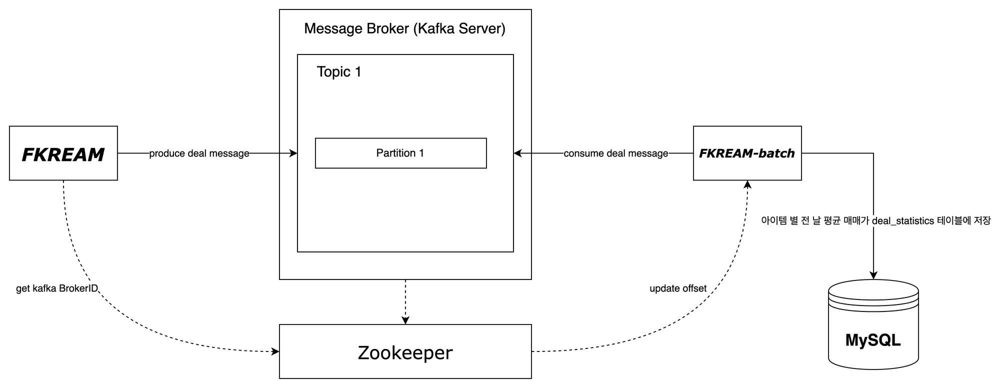

# fkream-batch

fkream-batch는 [FKREAM](https://github.com/f-lab-edu/FKREAM)의 거래 데이터를 처리하기 위해 Kafka, Spring Batch를
활용하여 통계 데이터베이스(MySQL)에 저장하는 프로젝트입니다.

## 목표

- Kafka를 사용하여 FKREAM의 아이템별 평균 거래가를 비동기적으로 처리합니다.
- Kafka 메시지 큐에 저장된 거래 데이터(ex: `{"itemId": 1, "price": 10000}`)를 Spring Batch를 활용하여 처리합니다.
- 하루 단위로 가져와서 전 날 평균 가격을 계산하고 통계 데이터베이스에 저장합니다.
- 시세 그래프에 필요한 데이터를 통계 전용 데이터베이스로 부터 데이터 호출하여 성능을 향상시킵니다.

## 설명

- 개발기간 : 2023.06.01 ~
- 백엔드 : Java 11, SpringBoot, JPA, SpringBatch, Kafka, MySQL
- Tool : IntelliJ, Gradle

## 소프트웨어 아키텍처

